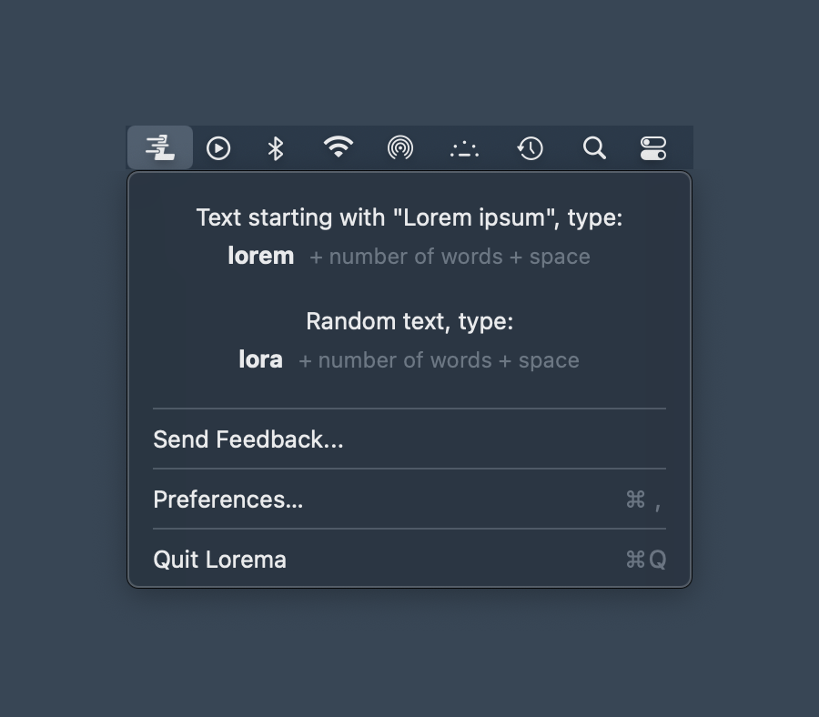
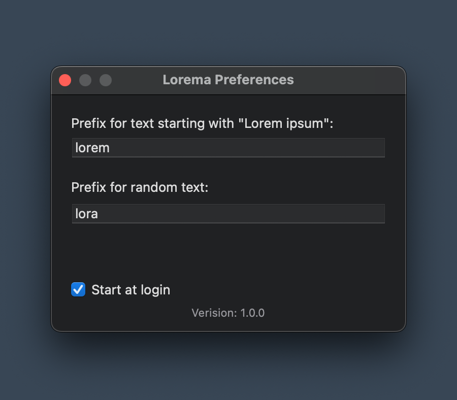

<p align="center">
  
</p>

<h1 align="center">Lorema</h1>

<p align="center">
  Generate Lorem Ipsum text anywhere on macOS.<br>
  Type a keyword, hit space, get placeholder text. That simple.
</p>

<p align="center">
  <a href="#installation">Install</a> · <a href="#usage">Usage</a> · <a href="#permissions">Permissions</a>
</p>

## Why?

Every design tool, code editor, and browser extension has its own way of generating Lorem Ipsum. Figma has a plugin. VSCode has a snippet. Chrome has seventeen extensions that all do it slightly differently. You end up memorizing a different shortcut for every app, or worse, googling "lorem ipsum generator" and copy-pasting from some ad-infested website like it's 2007. Or even worse, you type "text text text" and copy-paste that a billion times. I know, we've all been there. 

Lorema works at the OS level. Same trigger, same behavior, every app. Type `lorem50`, hit space, done. Whether you're in Figma, VSCode or any CMS.

One tool. Works everywhere. 

## Why Lorem Ipsum?

Lorem Ipsum works because your brain recognizes it instantly as meaningless. You see "Lorem ipsum" and you stop reading. That's the whole point. Your eyes move on to what actually matters: the layout, the spacing, the typography. Use real looking text and people will read it. Use gibberish that announces itself as gibberish and they won't.

## How it works

Lorema sits in your menu bar and listens for trigger words as you type. When it detects a prefix followed by a number and a space, it replaces what you typed with generated placeholder text. Works in any app.

<p align="center">
  
</p>

## Installation

### Homebrew (recommended)

```bash
brew tap DanielDanielsson/lorema
brew install --cask lorema
```

### From source

```bash
git clone https://github.com/DanielDanielsson/lorema-app.git
cd lorema-app
xcodebuild -project Lorema.xcodeproj -scheme Lorema -configuration Release build
```

The built app will be in `DerivedData/`. Move `Lorema.app` to `/Applications/`.

## Usage

### Lorem mode

Generates text starting with "Lorem ipsum dolor sit amet,"

```
lorem20⎵  →  20 words of classic Lorem Ipsum
lorem100⎵ →  100 words of classic Lorem Ipsum
```

### Random mode

Generates random Latin placeholder words.

```
lora20⎵   →  20 random Latin words
lora100⎵  →  100 random Latin words
```

Generate between 1 and 1,000 words at a time.

### Custom prefixes

Both trigger words are configurable in Preferences (`⌘,`).

<p align="center">
  
</p>

## Permissions

### Accessibility access

Lorema needs Accessibility permission to detect keystrokes and insert text.

1. Open **System Settings > Privacy & Security > Accessibility**
2. Click **+** and add **Lorema**
3. Make sure the toggle is enabled

### Unsigned app warning

Lorema is not signed with an Apple Developer certificate, so macOS will block it on first launch.

**To open it:** Right-click Lorema.app and select **Open**, then click **Open** in the dialog. Alternatively, go to **System Settings > Privacy & Security** and click **Open Anyway**.

You only need to do this once.

## License

[MIT](LICENSE)
